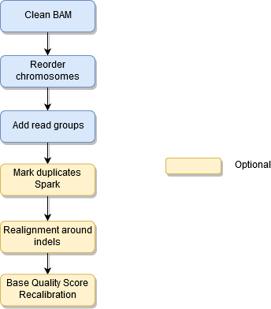

# TronFlow BAM preprocessing pipeline


[](https://github.com/TRON-Bioinformatics/tronflow-bam-preprocessing/actions/workflows/automated_tests.yml)
[](https://zenodo.org/badge/latestdoi/358400957)
[](https://opensource.org/licenses/MIT)
[](https://www.nextflow.io/)

The TronFlow BAM preprocessing pipeline is part of a collection of computational workflows for tumor-normal pair 
somatic variant calling. These workflows are implemented in the Nextflow (Di Tommaso, 2017) framework.

Find the documentation here [](https://tronflow-docs.readthedocs.io/en/latest/?badge=latest)


The aim of this workflow is to preprocess BAM files based on Picard and GATK (DePristo, 2011) best practices.


## Background

In order to have a variant calling ready BAM file there are a number of operations that need to be applied on the BAM. 
This pipeline depends on the particular variant caller, but there are some common operations.

GATK has been providing a well known best practices document on BAM preprocessing, the latest best practices for 
GATK4 (https://software.broadinstitute.org/gatk/best-practices/workflow?id=11165) does not perform anymore realignment around indels as opposed to best practices for GATK3 (https://software.broadinstitute.org/gatk/documentation/article?id=3238). This pipeline is based on both Picard and GATK. These best practices have been implemented a number of times, see for instance this implementation in Workflow Definition Language https://github.com/gatk-workflows/gatk4-data-processing/blob/master/processing-for-variant-discovery-gatk4.wdl.


## Objectives

We aim at providing a single implementation of the BAM preprocessing pipeline that can be used across different 
use cases. 
For this purpose there are some required steps and some optional steps.  

The input can be either a tab-separated values file (`--input_files`) where each line corresponds to one input BAM or a single BAM (`--input_bam` and `--input_name`).

## Implementation

Steps:

* **Clean BAM**. Sets the mapping quality to 0 for all unmapped reads and avoids soft clipping going beyond the reference genome boundaries. Implemented in Picard
* **Reorder chromosomes**. Makes the chromosomes in the BAM follow the same order as the reference genome. Implemented in Picard
* **Add read groups**. GATK requires that some headers are adde to the BAM, also we want to flag somehow the normal and tumor BAMs in the header as some callers, such as Mutect2 require it. Implemented in Picard.
* **Mark duplicates** (optional). Identify the PCR and the optical duplications and marks those reads. This uses the parallelized version on Spark, it is reported to scale linearly up to 16 CPUs.
* **Realignment around indels** (optional). This procedure is important for locus based variant callers, but for any variant caller doing haplotype assembly it is not needed. This is computing intensive as it first finds regions for realignment where there are indication of indels  and then it performs a local realignment over those regions. Implemented in GATK3, deprecated in GATK4
* **Base Quality Score Recalibration (BQSR)** (optional). It aims at correcting systematic errors in the sequencer when assigning the base call quality errors, as these scores are used by variant callers it improves variant calling in some situations. Implemented in GATK4
* **Metrics** (optional). A number of metrics are obtained from the BAM file with Picard's CollectMetrics, CollectHsMetrics and samtools' coverage and depth.




## How to run it

```
$ nextflow run tron-bioinformatics/tronflow-bam-preprocessing --help

N E X T F L O W  ~  version 19.07.0
Launching `main.nf` [intergalactic_shannon] - revision: e707c77d7b

Usage:
    main.nf --input_files input_files

Input:
    * --input_bam: the path to a single BAM (this option is not compatible with --input_files)
    * --input_files: the path to a tab-separated values file containing in each row the sample name, sample type (eg: tumor or normal) and path to the BAM file. The sample name should be unique for each bam file. (this option is not compatible with --input_bam)
    Sample type will be added to the BAM header @SN sample name
    The input file does not have header!
    Example input file:
    name1_t   tumor   tumor.1.bam
    name1_n   normal  normal.1.bam
    name2_t   tumor   tumor.2.bam
    * --reference: path to the FASTA genome reference (indexes expected *.fai, *.dict)

Optional input:
    * --input_name: the name of the sample. Only used when --input_bam is provided (default: normal)
    * --dbsnp: path to the dbSNP VCF (required to perform BQSR)
    * --known_indels1: path to a VCF of known indels (optional to perform realignment around indels)
    * --known_indels2: path to a second VCF of known indels (optional to perform realignment around indels)
    * --intervals: path to a BED file to collect coverage and HS metrics from (default: None)
    * --collect_hs_minimum_base_quality: minimum base quality for a base to contribute coverage (default: 20).
    * --collect_hs_minimum_mapping_quality: minimum mapping quality for a read to contribute coverage (default: 20).
    * --skip_bqsr: optionally skip BQSR (default: false)
    * --skip_realignment: optionally skip realignment (default: false)
    * --skip_deduplication: optionally skip deduplication (default: false)
    * --remove_duplicates: removes duplicate reads from output BAM instead of flagging them (default: true)
    * --skip_metrics: optionally skip metrics (default: false)
    * --output: the folder where to publish output (default: ./output)
    * --platform: the platform to be added to the BAM header. Valid values: [ILLUMINA, SOLID, LS454, HELICOS and PACBIO] (default: ILLUMINA)
    * --split_cigarn: split reads that contain Ns in their cigar string (e.g. spanning splicing events in RNAseq data) using GATKs SplitNCigarReads
    * --split_cigarn_args: additional arguments for SplitNCigarReads

Computational resources:
    * --prepare_bam_cpus: (default: 3)
    * --prepare_bam_memory: (default: 8g)
    * --mark_duplicates_cpus: (default: 16)
    * --mark_duplicates_memory: (default: 64g)
    * --realignment_around_indels_cpus: (default: 2)
    * --realignment_around_indels_memory: (default: 31g)
    * --bqsr_cpus: (default: 3)
    * --bqsr_memory: (default: 4g)
    * --metrics_cpus: (default: 1)
    * --metrics_memory: (default: 8g)

 Output:
    * Preprocessed and indexed BAMs
    * Tab-separated values file with the absolute paths to the preprocessed BAMs, preprocessed_bams.txt

Optional output:
    * Recalibration report
    * Deduplication metrics
    * Realignment intervals
    * GATK multiple metrics
    * HS metrics
    * Horizontal and vertical coverage metrics
```

### Input table

The table with FASTQ files expects two tab-separated columns **without a header**

| Sample name          | Sample type                      | BAM                  |
|----------------------|---------------------------------|------------------------------|
| sample_1             | normal      |    /path/to/sample_1.normal.bam   |
| sample_1             | tumor      |    /path/to/sample_1.tumor.bam   |
| sample_2             | normal      |    /path/to/sample_2.normal.bam   |
| sample_2             | tumor      |    /path/to/sample_2.tumor.bam   |

The values used in `sample type` are arbitrary. These will be set in the BAM header tag @RG:SM for sample. There may be some downstream constraints, eg: Mutect2 pipeline requires that the sample type between normal and tumor samples of the same pair are not the same.

### References

The BAM preprocessing workflow requires the human reference genome (`--reference`)
Base Quality Score Recalibration (BQSR) requires dbSNP to avoid extracting error metrics from polymorphic sites (`--dbsnp`)
Realignment around indels requires a set of known indels (`--known_indels1` and `--known_indels2`).
These resources can be fetched from the GATK bundle https://gatk.broadinstitute.org/hc/en-us/articles/360035890811-Resource-bundle.

Optionally, in order to run Picard's CollectHsMetrics a BED file will need to be provided (`--intervals`).
This BED file will also be used for `samtools coverage`.

## Troubleshooting

### Too new Java version for MarkDuplicatesSpark

When using Java 11 the cryptic error messsage `java.lang.IllegalArgumentException: Unsupported class file major version 55` has been observed.
This issue is described here and the solution is to use Java 8 https://gatk.broadinstitute.org/hc/en-us/community/posts/360056174592-MarkDuplicatesSpark-crash.


## Bibliography

* DePristo M, Banks E, Poplin R, Garimella K, Maguire J, Hartl C, Philippakis A, del Angel G, Rivas MA, Hanna M, McKenna A, Fennell T, Kernytsky A, Sivachenko A, Cibulskis K, Gabriel S, Altshuler D, Daly M. (2011). A framework for variation discovery and genotyping using next-generation DNA sequencing data. Nat Genet, 43:491-498. DOI: 10.1038/ng.806.
* Di Tommaso, P., Chatzou, M., Floden, E. W., Barja, P. P., Palumbo, E., & Notredame, C. (2017). Nextflow enables reproducible computational workflows. Nature Biotechnology, 35(4), 316–319. 10.1038/nbt.3820
