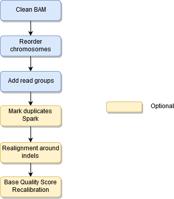

# TRONflow BAM preprocessing pipeline

Nextflow pipeline for the preprocessing of BAM files based on Picard and GATK.


## Background

In order to have a variant calling ready BAM file there are a number of operations that need to be applied on the BAM. This pipeline depends on the particular variant caller, but there are some common operations.

GATK has been providing a well known best practices document on BAM preprocessing, the latest best practices for GATK4 (https://software.broadinstitute.org/gatk/best-practices/workflow?id=11165) does not perform anymore realignment around indels as opposed to best practices for GATK3 (https://software.broadinstitute.org/gatk/documentation/article?id=3238). This pipeline is based on both Picard and GATK. These best practices have been implemented a number of times, see for instance this implementation in Workflow Definition Language https://github.com/gatk-workflows/gatk4-data-processing/blob/master/processing-for-variant-discovery-gatk4.wdl.


## Objectives

We aim at providing a single implementation of the BAM preprocessing pipeline that can be used across different situations. For this purpose there are some required steps and some optional steps. This is implemented as a Nextflow pipeline to simplify parallelization of execution in the cluster. The default configuration uses reference genome hg19, if another reference is needed the adequate resources must be provided. The reference genome resources  for hg19 were downloaded from https://software.broadinstitute.org/gatk/download/bundle

The input is a tab-separated values file where each line corresponds to one input BAM. The output is another tab-separated values file with the absolute paths of the preprocessed and indexed BAMs.

## Implementation

Steps:

* **Clean BAM**. Sets the mapping quality to 0 for all unmapped reads and avoids soft clipping going beyond the reference genome boundaries. Implemented in Picard
* **Reorder chromosomes**. Makes the chromosomes in the BAM follow the same order as the reference genome. Implemented in Picard
* **Add read groups**. GATK requires that some headers are adde to the BAM, also we want to flag somehow the normal and tumor BAMs in the header as some callers, such as Mutect2 require it. Implemented in Picard.
 * **Mark duplicates** (optional). Identify the PCR and the optical duplications and marks those reads. This uses the parallelized version on Spark, it is reported to scale linearly up to 16 CPUs.
 * **Realignment around indels** (optional). This procedure is important for locus based variant callers, but for any variant caller doing haplotype assembly it is not needed. This is computing intensive as it first finds regions for realignment where there are indication of indels  and then it performs a local realignment over those regions. Implemented in GATK3, deprecated in GATK4
 * **Base Quality Score Recalibration (BQSR)** (optional). It aims at correcting systematic errors in the sequencer when assigning the base call quality errors, as these scores are used by variant callers it improves variant calling in some situations. Implemented in GATK4



## How to run it

```
$ nextflow run tron-bioinformatics/tronflow-bam-preprocessing -r v1.0.0 --help
N E X T F L O W  ~  version 19.07.0
Launching `main.nf` [intergalactic_shannon] - revision: e707c77d7b
Usage:
    main.nf --input_files input_files
 
Input:
    * input_files: the path to a tab-separated values file containing in each row the sample name, sample type (eg: tumor or normal) and path to the BAM file
    Sample type will be added to the BAM header @SN sample name
    The input file does not have header!
    Example input file:
    name1       tumor   tumor.1.bam
    name1       normal  normal.1.bam
    name2       tumor   tumor.2.bam
 
Optional input:
    * reference: path to the FASTA genome reference (indexes expected *.fai, *.dict)
    * dbsnp: path to the dbSNP VCF
    * known_indels1: path to a VCF of known indels
    * known_indels2: path to a second VCF of known indels
    * NOTE: if any of the above parameters is not provided, default hg19 resources will be used
    * skip_bqsr: optionally skip BQSR
    * skip_realignment: optionally skip realignment
    * skip_deduplication: optionally skip deduplication
    * output: the folder where to publish output, if not provided they will be moved to "output" folder inside the workflow folder* prepare_bam_cpus: default 3
    * platform: the platform to be added to the BAM header. Valid values: [ILLUMINA, SOLID, LS454, HELICOS and PACBIO] (default: ILLUMINA)
    * prepare_bam_memory: default 8g
    * mark_duplicates_cpus: default 16
    * mark_duplicates_memory: default 64g
    * realignment_around_indels_cpus: default 2
    * realignment_around_indels_memory: default 32g
    * bqsr_cpus: default 3
    * bqsr_memory: default 4g
 
 Output:
    * Preprocessed and indexed BAMs
    * Tab-separated values file with the absolute paths to the preprocessed BAMs, preprocessed_bams.txt
 
Optional output:
    * Recalibration report
    * Realignment intervals
    * Duplication metrics
```
